# Automatic Machine Fault Detection from Acoustic Data using Deep Learning

## Overview
This project implements an automated fault detection framework for electrical machines by analyzing audio signals. The system extracts time–frequency features—such as MFCCs, STFT magnitude, and phase—from audio recordings, transforms them into image representations (square spectrogram images), and classifies them using a convolutional neural network (CNN). The approach is designed to provide a non-invasive, cost-effective solution for detecting common machine faults like Arcing, Corona, Looseness, and Tracking.

## Table of Contents
- [Project Description](#project-description)
- [Dataset Details](#dataset-details)
- [Installation and Setup](#installation-and-setup)
- [Usage Instructions](#usage-instructions)
- [Code Structure](#code-structure)
- [Project Results](#project-results)
- [Conclusions and Future Work](#conclusions-and-future-work)
- [Credits and Acknowledgments](#credits-and-acknowledgments)
- [License](#license)

## Project Description
This project focuses on detecting faults in electrical machines by leveraging audio signal processing and deep learning techniques. The key steps include:

- **Data Collection:** Audio files are gathered from a Google Drive folder. The dataset (provided as a ZIP file) contains recordings labeled with one of four fault types: Arcing, Corona, Looseness, or Tracking.
- **Feature Extraction:**  
  - Audio signals are segmented into short overlapping chunks (e.g., 0.35 seconds with 20% overlap).  
  - For each segment, features are extracted using:  
    - **MFCCs:** Capturing the spectral envelope (typically 13 coefficients).  
    - **STFT:** Calculating the magnitude (converted to decibels) and phase information.  
  - Each feature matrix is resized to a square format (e.g., 64×64 pixels) using interpolation to ensure consistency for CNN input.
- **Data Augmentation:** Augmentation techniques such as time stretching, pitch shifting, and noise addition are applied to enhance dataset diversity and improve model robustness.
- **CNN Model Training:** The extracted and preprocessed feature images are used to train a CNN architecture that includes multiple convolutional and pooling layers, dropout for regularization, and dense layers for classification.
- **Performance Evaluation:** The model’s performance is evaluated using training/validation metrics and visualized through plots and a confusion matrix.

## Dataset Details
- **Source:** The dataset is provided as a ZIP archive and stored on Google Drive.
- **Organization:** Audio files are organized into subfolders based on the fault type labels (Arcing, Corona, Looseness, Tracking). File names include keywords that are used to automatically classify the recordings.
- **Data Format:** The audio recordings are in formats such as WAV, MP3, or FLAC.

### Sample Images from Each Class
Below are three sample images (feature representations) from each fault class after preprocessing:

| Class    | Sample 1                                                         | Sample 2                                                         | Sample 3                                                         |
|----------|------------------------------------------------------------------|------------------------------------------------------------------|------------------------------------------------------------------|
| **Arcing**    | 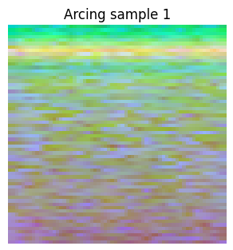 <br/> *Figure: Arcing #1* | 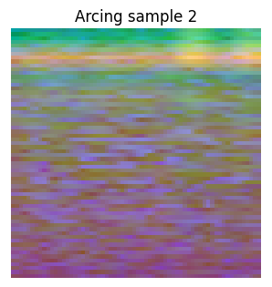 <br/> *Figure: Arcing #2* | 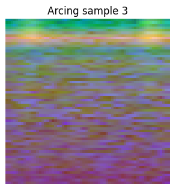 <br/> *Figure: Arcing #3* |
| **Corona**    | 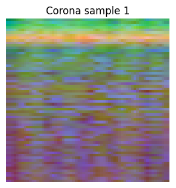 <br/> *Figure: Corona #1* | 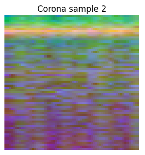 <br/> *Figure: Corona #2* | 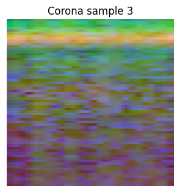 <br/> *Figure: Corona #3* |
| **Looseness** | 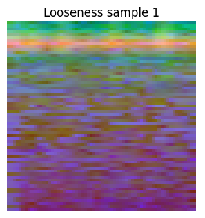 <br/> *Figure: Looseness #1* | 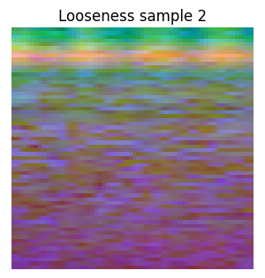 <br/> *Figure: Looseness #2* | 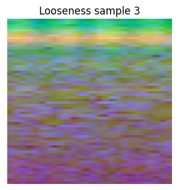 <br/> *Figure: Looseness #3* |
| **Tracking**  | 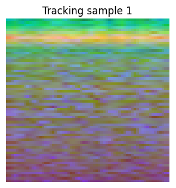 <br/> *Figure: Tracking #1* | 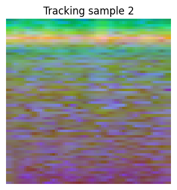 <br/> *Figure: Tracking #2* | 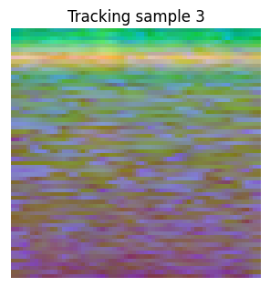 <br/> *Figure: Tracking #3* |

These images illustrate the visual representations of the audio segments after applying MFCC, STFT magnitude (in dB), and phase features.

## Installation and Setup
Follow these steps to set up the project on your local machine or Google Colab:

1. **Clone the Repository:**
   ```bash
   git clone https://github.com/Abdullah-Engineer/CV-Project.git
   cd CV-Project
   ```

2. **Install Required Libraries:**
   Use the following command to install necessary Python libraries:
   ```bash
   pip install gdown librosa tensorflow matplotlib scikit-learn opencv-python seaborn
   ```

3. **Mount Google Drive (for Colab users):**
   If you are using Google Colab, mount your Google Drive:
   ```python
   from google.colab import drive
   drive.mount('/content/drive')
   ```

4. **Download and Extract the Dataset:**
   - Use the provided Google Drive file ID/URL to download the ZIP file:
     ```python
     import gdown, zipfile
     file_id = "1Oxbcp06EaSfctkHM--SGJQzHFfFO4nmG"
     zip_filename = "fault_dataset.zip"
     download_url = f"https://drive.google.com/uc?id={file_id}"
     gdown.download(download_url, zip_filename, quiet=False)
     with zipfile.ZipFile(zip_filename, 'r') as zip_ref:
         zip_ref.extractall("fault_dataset")
     ```

## Usage Instructions
1. **Data Preprocessing:**
   - Organize audio files into subfolders based on fault type (Arcing, Corona, Looseness, Tracking).
   - Segment the audio recordings into overlapping chunks.
   - Extract features (MFCC, STFT magnitude in dB, and phase) and resize them into square images (e.g., 64×64 pixels).

2. **Data Augmentation:**
   - Apply audio augmentation techniques (time stretching, pitch shifting, noise addition) to increase the robustness of the model.

3. **Feature Normalization and Saving:**
   - Normalize the extracted feature images.
   - Save the processed images into a specified folder structure on Google Drive for further use.

4. **Model Training and Evaluation:**
   - Encode class labels and split the dataset into training, validation, and test sets.
   - Build and compile the CNN using TensorFlow/Keras.
   - Train the model using the training set and monitor the performance on the validation set.
   - Evaluate the model’s accuracy and generate performance visualizations (loss curves, accuracy curves, confusion matrix, etc.).

## Code Structure
The project code is organized as follows:

- **Data Acquisition & Preprocessing:**
  - Code for downloading the dataset, organizing files into fault-specific folders, and segmenting audio files.
  - Feature extraction functions: `extract_features(audio, sr)` extracts MFCC, STFT magnitude, and phase; `augment_audio(audio, sr)` applies augmentation.
- **Image Processing:**
  - Normalization and conversion of feature matrices to square images.
  - Saving processed images to a structured directory in Google Drive.
- **Dataset Preparation:**
  - Encoding labels and splitting the dataset into training, validation, and test sets.
- **Model Building:**
  - CNN architecture including convolutional layers, pooling layers, dropout for regularization, and dense layers for classification.
  - Model compilation and summary.
- **Model Training & Evaluation:**
  - Training the CNN model with early stopping.
  - Plotting training/validation loss and accuracy.
  - Generating a confusion matrix and classification report.

## Project Results

### CNN Architecture Diagram
Below is the CNN architecture diagram generated by the code:

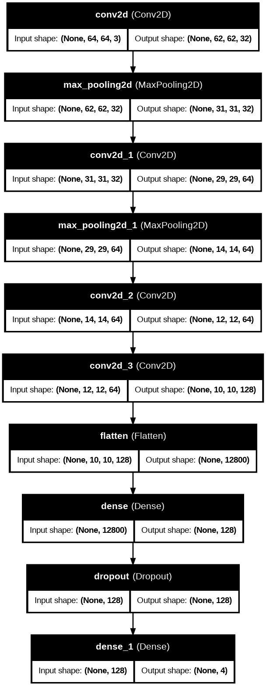  
*Figure: CNN architecture with multiple Conv2D layers, pooling layers, and dense layers in Top to Bottom.*

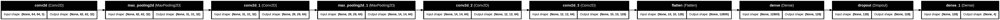  
*Figure: CNN architecture with multiple Conv2D layers, pooling layers, and dense layers in Left to Right.*

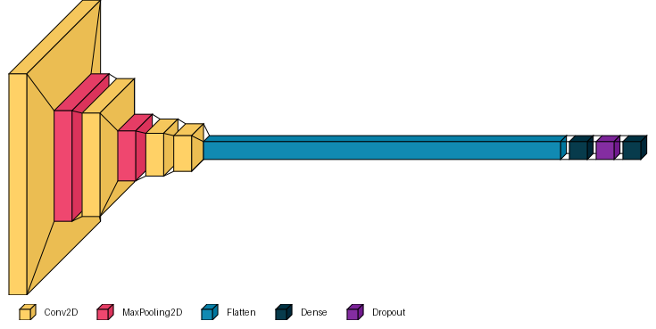  
*Figure: CNN architecture with multiple Conv2D layers, pooling layers, and dense layers, created using visual keras.*

### Loss and Accuracy Graphs
After training for 20 epochs, the following graphs illustrate how the training and validation loss/accuracy evolved:

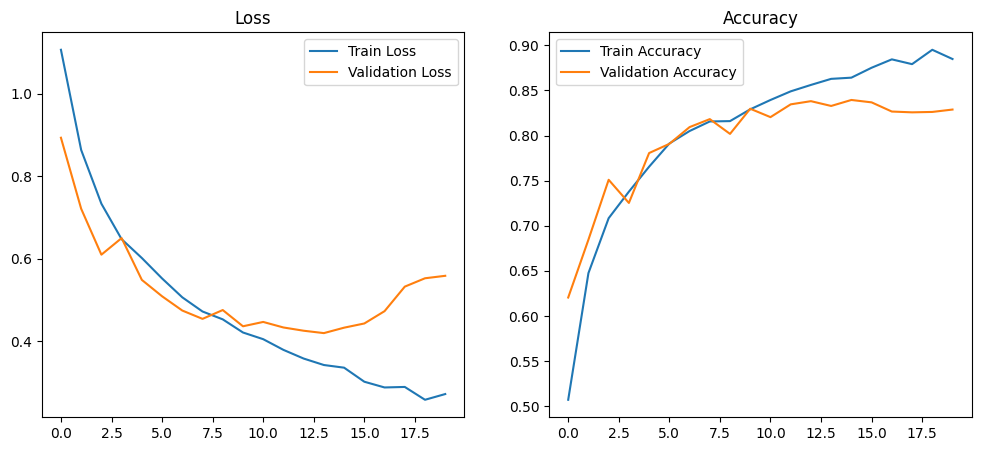  
*Figure: Training and validation loss (left), and training and validation accuracy (right).*

### Confusion Matrix
The confusion matrix below provides insight into the classification performance across the four fault classes:

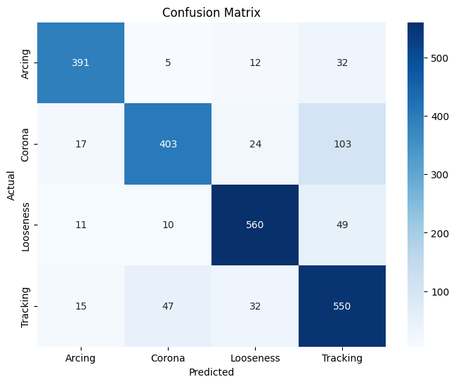  
*Figure: Rows represent actual classes, columns represent predicted classes.*

### Classification Report
The classification report below provides insights into the classification performance across the four fault classes:

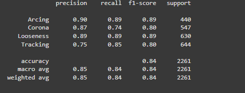  
*Figure: Rows represent actual classes, and columns represent predicted classes.*


### Multiclass ROC Curve
We also compute the ROC curve for each class, along with the AUC (Area Under the Curve) values:

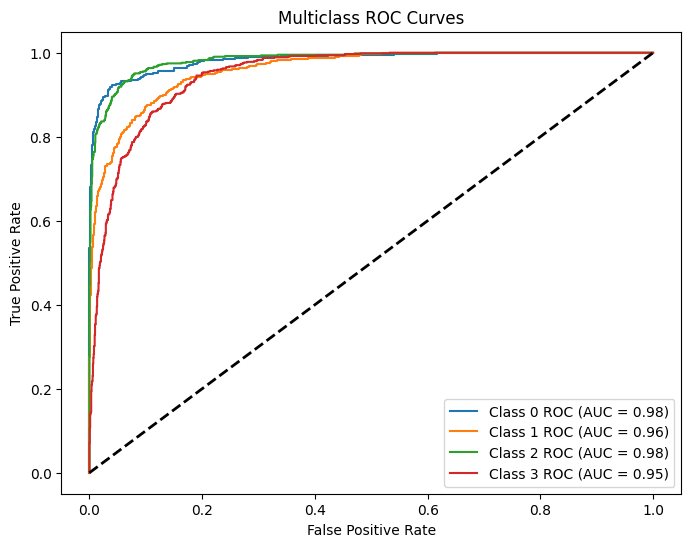  
*Figure: ROC curves for Arcing, Corona, Looseness, and Tracking classes.*

### Precision-Recall Curves
Here are the precision-recall curves for each class, illustrating the trade-off between precision and recall:

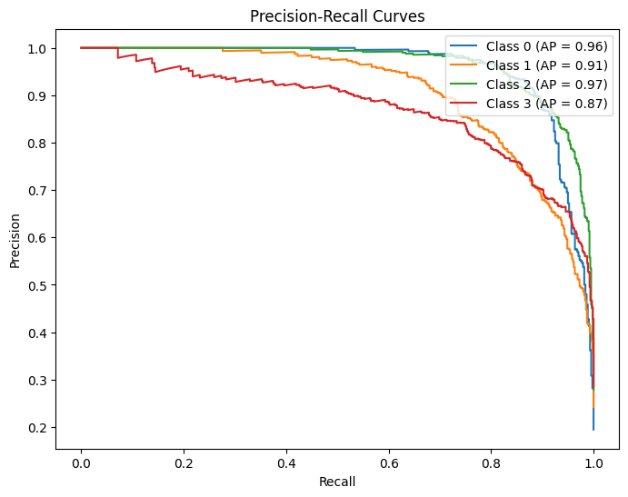  
*Figure: Precision-Recall curves for the four classes.*

### Feature Maps from the First Convolutional Layer
Finally, we visualize feature maps from the first convolutional layer for a sample test image:

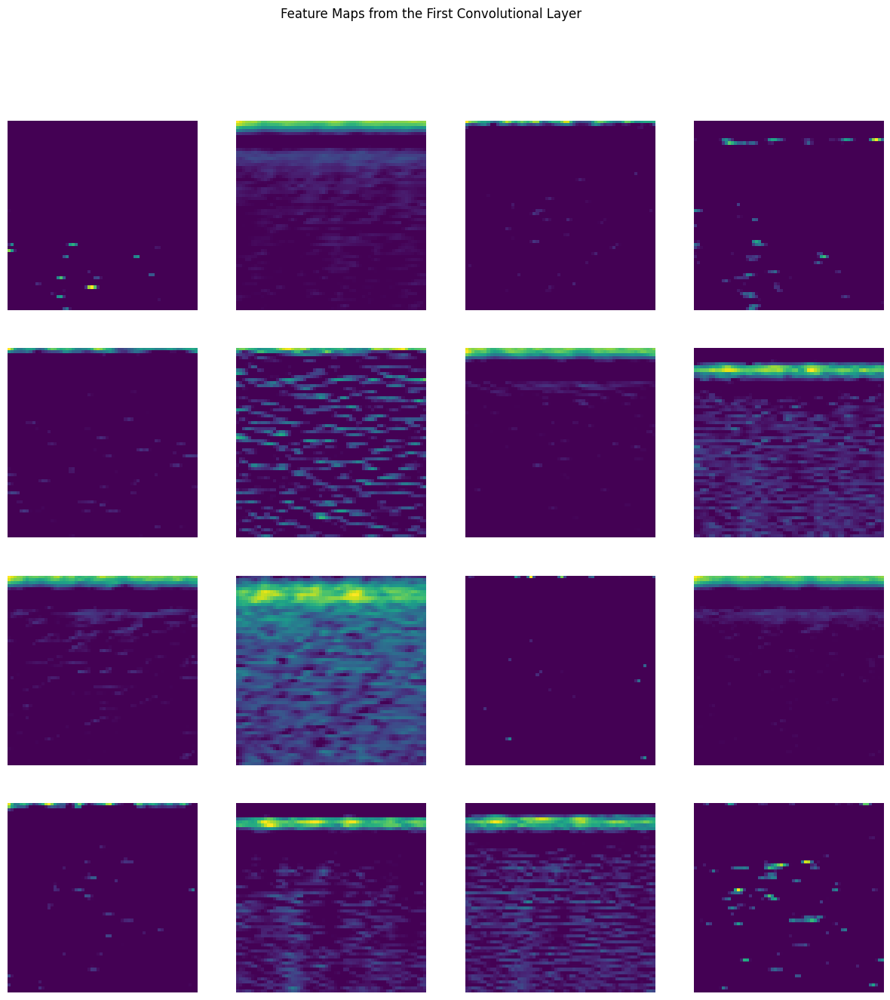  
*Figure: Activation maps for the first convolutional layer, showing how the network responds to different spatial patterns.*

---

- **Performance:** The CNN model achieved a test accuracy of approximately 80.76% (or ~83%, depending on the final training run).  
- **Insights:** These results demonstrate that converting audio signals into spectrogram-like images combined with CNN-based classification is effective for machine fault detection. Some fault classes, such as Tracking, can show slightly lower recall, suggesting potential for further refinements.

## Conclusions and Future Work

- **Conclusions:** The project successfully demonstrates a non-invasive method for detecting machine faults using audio signal processing and deep learning. The conversion of audio signals to image representations, combined with data augmentation and CNN training, yields a robust fault detection system.
- **Future Work:** Potential enhancements include:
  - Experimenting with deeper or alternative network architectures.
  - Implementing additional feature extraction techniques.
  - Exploring further data augmentation strategies.
  - Refining preprocessing methods to boost performance, especially for classes with lower recall.

## Credits and Acknowledgments

- **Team Members:**  
  - Hanzala Khalid      (2021-SE-05)  
  - Ahtsham ul Haq      (2021-SE-25)  
  - Abdullah Shahid     (2021-SE-32)

- **Supervision:** Engr. Dr. Ahmad Khawaja  
- **Libraries and Tools:** TensorFlow, Librosa, OpenCV, Scikit-learn, Matplotlib, Seaborn, and Google Colab.  
- **Special Thanks:** Acknowledgment to the contributors and open-source communities for the tools and libraries used in this project.

## License
This project is licensed under the [MIT License](LICENSE).
